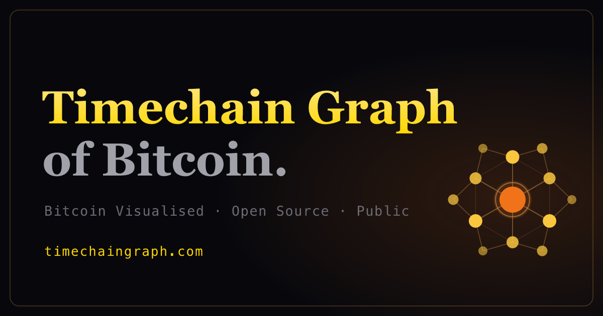

# Timechain Graph

<p align="center">
  
</p>

> **The Graph of Bitcoin.** Every wallet a node. Every transaction an edge.
> Watch the network form — Satoshi at the gold center, miners glowing red,
> whales gold, dust grey, all bound by the bonds they spent.

[](LICENSE)
[](https://github.com/timechaingraph/timechaingraph/actions/workflows/ci.yml)
[](https://timechaingraph.com)
[](https://timechaingrid.com)
[](#privacy)

A privacy-first, force-directed 2D visualization of every economically
meaningful Bitcoin wallet. Position emerges from transaction frequency.
Edges fade across ten blocks. Hubs swell with degree centrality. No
third-party calls at runtime, no analytics, no tracking.

Live at **[timechaingraph.com](https://timechaingraph.com)**. Sister project at
**[timechaingrid.com](https://timechaingrid.com)** — the same Bitcoin chain at
fixed coordinates on a stationary grid.

---

## Status

**`v0.0.1`** — marketing shell live; data ingestion in progress.

- ✅ Site shell deployed: landing, about, docs, privacy, pricing, status, donate
- ✅ Graph view canvas code complete (PixiJS force-directed renderer, Velocity-Verlet physics, drag-to-pin, cursor-anchored zoom, kiosk HUD)
- ⏳ Block-snapshot data ingestion in progress (operator-side full-node sync)
- ⏳ Graph view shows an "under development" placeholder until ingestion completes

**Roadmap:**

| Version | Target | Status |
|---|---|---|
| `v0.0.1` | Marketing shell + canvas code | **Live** |
| `v0.1` | Living Lattice — first real chain data shipped via static snapshots | In progress |
| `v0.2` | Real Bitcoin chain via DuckDB-Wasm + Parquet bundle on R2 | Planned |
| `v0.3` | Cluster Lattice — full database, common-input clustering, wallet-empire highlighting, Tor onion service | Planned |

---

## Run locally

```bash
git clone https://github.com/timechaingraph/timechaingraph.git
cd timechaingraph
npm install
npm run dev          # → http://localhost:3000
```

The marketing site routes at `http://localhost:3000/`. The graph canvas (when
data is present) is at `http://localhost:3000/graph`. Drag-to-pin a wallet,
scroll-to-zoom (cursor-anchored), keys `1` / `2` / `3` cycle spotlight depth,
`0` clears focus, `ESC` exits focus mode.

---

## Build & deploy

```bash
npm run build           # static export → out/
npm run privacy-audit   # confirms no third-party calls leak into out/
npm run deploy          # Cloudflare Pages (wrangler — direct upload)
```

Full deploy walkthrough is in [DEPLOY.md](DEPLOY.md).

---

## Tech

- **Framework**: Next.js 16 (App Router, Turbopack, `output: 'export'`)
- **Language**: TypeScript 5, React 19
- **Rendering**: PixiJS 8 — force-directed canvas with Velocity-Verlet physics,
  pairwise Coulomb repulsion, Hooke springs per bond, damping
- **State**: Zustand 5
- **Styling**: Tailwind CSS 4 (cyber-steampunk dark palette, system fonts only —
  no Google Fonts, no external font CDNs)
- **Testing**: Vitest 4 + React Testing Library
- **Data**: static Parquet bundle from a CDN we control (Cloudflare R2),
  queried in-browser via DuckDB-Wasm (planned for v0.2)
- **Deploy**: Cloudflare Pages (`timechaingraph` project), custom domain
  `timechaingraph.com`

---

## Project layout

```
src/
├── app/                Next.js App Router (layout, /graph kiosk, route shells)
├── components/         NavBar, SiteFooter, WalletInspector, HeroVisual,
│                       GraphView (PixiJS canvas), GraphPlayBar, GraphSidebar
├── data/               Chain adapter (Parquet client for v0.2)
├── lib/                site-config (brand identity), forceLayout (physics),
│                       formatters, proximity, coords, role-visuals
├── store/              Zustand store
└── types/              wallet, block, lattice — typed contracts

chain-tools/            offline operator-side data pipeline
├── ingest/             bitcoind JSON-RPC (getblock v3) block walker
├── lib/                RPC client, window combiner, extractors, halving math
├── export/             DuckDB out-of-core reduce → public Parquet bundle
└── audit/              substrate validation

public/
├── status.json         live status metadata (regenerated per-block)
└── blocks/             per-block JSON snapshots (gitignored — regenerated)
```

`chain-tools/` is **operator-side only**. It is never run by the browser; it
runs on the operator's machine against a full Bitcoin node and produces the
data the site eventually serves. Browser code lives entirely in `src/`.

---

## Why this project

There are dozens of Bitcoin block explorers. Almost all of them call out to
third-party CDNs the moment you load them — Google Fonts, Google Analytics,
custom telemetry. None of them visualize the chain as a *living network*.

Timechain Graph is **observably private** (open the DevTools Network tab and
you will see zero requests to anything but `timechaingraph.com`) and treats
the chain as a graph in the literal mathematical sense — wallets are nodes,
transactions are edges, position emerges from interaction frequency.

The data pipeline is local: source data flows from Bitcoin's own peer-to-peer
network into a self-hosted bitcoind full node that this project's operator
provisions, read directly over its JSON-RPC interface — no third-party indexer.
Distribution is via a CDN bucket we control. No KYC, no per-viewer telemetry,
no third-party dependencies at runtime.

---

## Privacy

**Non-negotiable boundary.** The browser, when serving this site, makes no
third-party requests at runtime. CSS, JS, fonts, and data are all served from
the same origin. The CI workflow (`.github/workflows/ci.yml`) runs a privacy
audit on every push and fails the build if any of the following domains leak
into the output bundle:

```
fonts.googleapis.com   fonts.gstatic.com    googletagmanager.com
google-analytics.com   doubleclick.net      cdn.jsdelivr.net
unpkg.com              cdnjs.cloudflare.com polyfill.io
```

See [`scripts/privacy-audit.sh`](scripts/privacy-audit.sh) for the full block
list and audit logic.

---

## Access

Everything is **free and public** — no tiers, no accounts, no paywall, no KYC.
The viewer loads a single public dataset of the most economically significant
wallets (the node count is bounded to what the browser can render). The project
is funded entirely by voluntary Bitcoin donations — see [Support](#support).

---

## Sibling architecture

This repository (`timechaingraph`) is a sibling of `timechaingrid`. Both share
most code byte-for-byte (components, types, utilities, theme); divergence is
captured in **`src/lib/site-config.ts`**, which encodes brand, domain, sister
pointer, and view-specific hero copy.

---

## Support

Timechain Graph is free and open source, funded entirely by voluntary Bitcoin
donations — no ads, no tracking, no token, no paywall, no funding round.

**Donate on-chain (BTC):**
[`bc1q2hhsxyuzj4e6wcjegayddjphdry02wdef9v62l`](https://timechaingraph.com/donate)

Scan the QR on the **[donate page](https://timechaingraph.com/donate)** — always
treat that page as the canonical source and verify the address there before
sending. Donations go to running the project: hosting, the self-hosted bitcoind
full node, and CDN bandwidth for the data bundle.

---

## Contributing

PRs welcome. See [CONTRIBUTING.md](CONTRIBUTING.md) for the workflow, testing
requirements, and the privacy rule (any new dependency or runtime call must
not leak viewer identity).

---

## Security

To report a security vulnerability, see [SECURITY.md](SECURITY.md). Do not
open public issues for security problems.

---

## License

[MIT](LICENSE) © 2026 Timechaingraph contributors.

---

Built on the open Bitcoin protocol. No coin, no token, no funding round.
